# Clase 1: POC de Turnos Online con Virtualización en VirtualBox

Mock simple de turnos online para la `Clinica Veterinaria Firulais`, pensado para practicar infraestructura local, virtualización y despliegue básico en una maquina virtual con Ubuntu Server.

## Esquema general

La idea del laboratorio es levantar el servidor dentro de una VM y consumirlo desde otra maquina o desde el navegador del host usando la IP que recibe la VM en la red local.

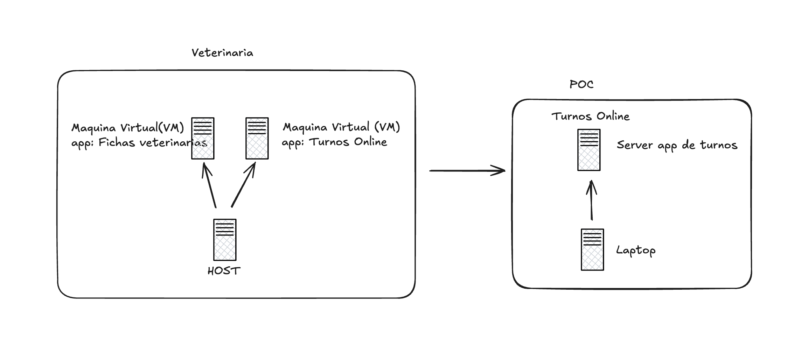

## Contexto de la POC

Esta POC forma parte del caso transversal de la `Clinica Veterinaria Firulais` visto en `clase1.pdf`.

Escenario de negocio:

- la clínica ya tiene infraestructura `on-premise`
- hoy existe una necesidad nueva: publicar un portal de turnos online
- el enfoque tradicional implicaría comprar otro servidor físico
- esa compra suma costo, tiempo de instalación y más carga operativa

Pregunta de la clase:

- `¿podemos crear este nuevo servicio sin comprar otra máquina?`

Respuesta que explora esta práctica:

- sí, usando virtualización sobre un host existente
- en este laboratorio, el hipervisor es `VirtualBox`
- la VM nueva corre Ubuntu Server y dentro de ella se despliega la app de turnos

## Qué se busca demostrar

Con esta práctica no buscamos solo levantar una aplicación. También buscamos mostrar que:

- un mismo host físico puede ejecutar varias máquinas virtuales
- cada VM recibe CPU, memoria, disco y red asignados
- el aprovisionamiento de un nuevo servicio es más rápido que comprar hardware nuevo
- el hardware existente puede aprovecharse mejor
- este modelo sirve como paso intermedio para entender después la evolución hacia cloud

## Objetivo de la clase

Al terminar esta guia deberias poder:

- instalar VirtualBox en tu equipo
- descargar Ubuntu Server
- crear una maquina virtual nueva
- cambiar la red de la VM de `NAT` a `Bridged Adapter`
- clonar este repositorio dentro de la VM
- iniciar la app y verla desde tu navegador usando la IP de la maquina virtual

## Stack del proyecto

- Python 3
- `http.server`
- Bootstrap 5 por CDN

## Parte 1: Descargar las herramientas

### Paso 1. Entrar al sitio de VirtualBox

Abre [VirtualBox](https://www.virtualbox.org/) en tu navegador. Desde la portada puedes entrar a la seccion de descarga del instalador.

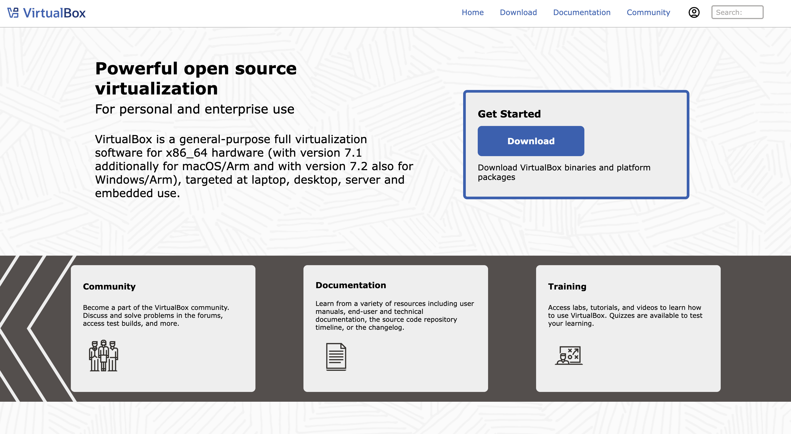

### Paso 2. Descargar el instalador de VirtualBox

En la pagina de descargas, elige el paquete correspondiente a tu sistema operativo host:

- `Windows hosts` si estas trabajando en Windows
- `macOS / Intel hosts` si tu Mac usa procesador Intel
- `macOS / Apple Silicon hosts` si tu Mac usa chip M1, M2, M3 o similar
- `Linux distributions` si tu maquina anfitriona usa Linux

Instala VirtualBox antes de continuar con la configuracion de la VM.

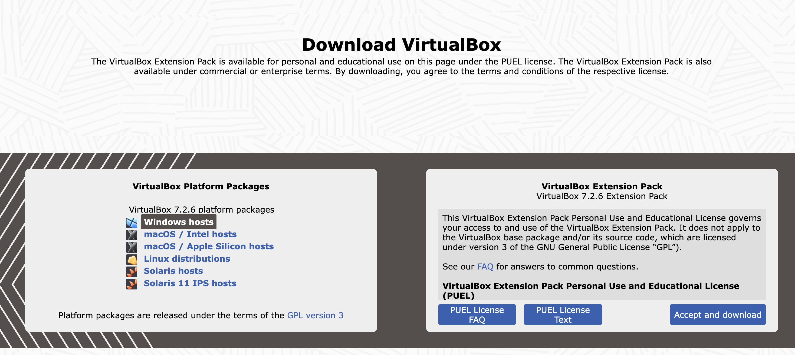

### Paso 3. Descargar Ubuntu Server

Abre [Ubuntu Server](https://ubuntu.com/download/server) y descarga la version LTS mas reciente disponible. Esa ISO se usara como disco de instalacion de la maquina virtual.

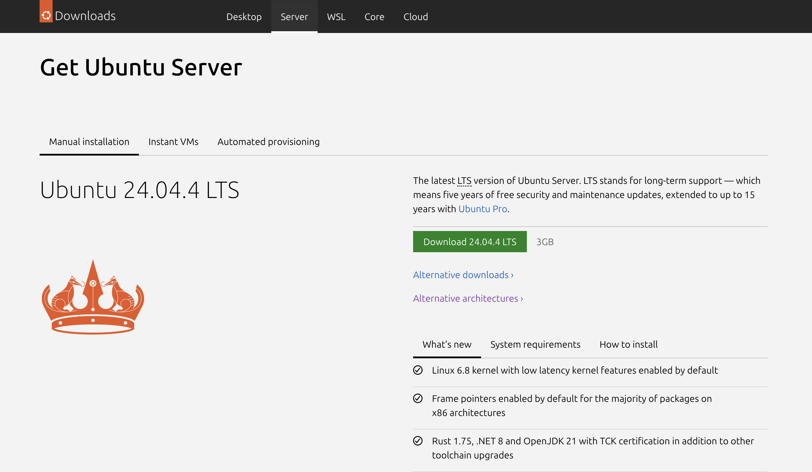

## Parte 2: Crear la maquina virtual

### Paso 4. Abrir VirtualBox y crear una VM nueva

Inicia VirtualBox y presiona `New`. Eso abre el asistente para crear una nueva maquina virtual.

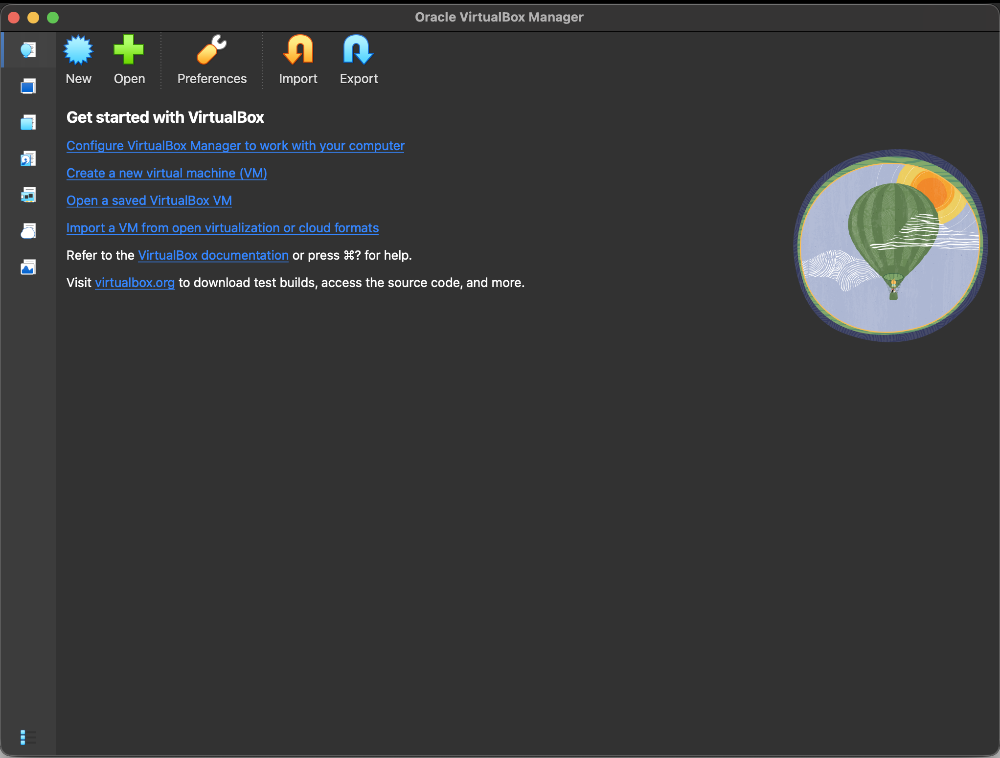

### Paso 5. Elegir nombre, carpeta e ISO

En el primer bloque del asistente:

- asigna un nombre descriptivo, por ejemplo `poc-turnos`
- deja la carpeta por defecto o elige otra ubicacion si lo necesitas
- selecciona la ISO de Ubuntu Server que descargaste

VirtualBox deberia detectar automaticamente que se trata de `Linux` y `Ubuntu`.

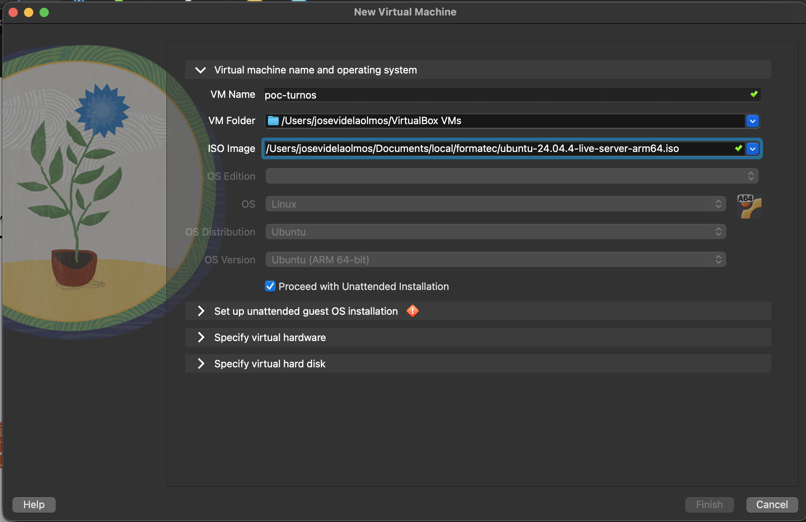

### Paso 6. Configurar usuario y host de Ubuntu

En la instalacion desatendida completa:

- `User Name`: el usuario con el que vas a entrar a Ubuntu
- `Password` y `Confirm Password`: la contrasena de ese usuario
- `Host Name`: el nombre de la maquina virtual dentro de la red

Ejemplo del laboratorio:

- usuario: `vboxuser`
- host: `poc-turnos`

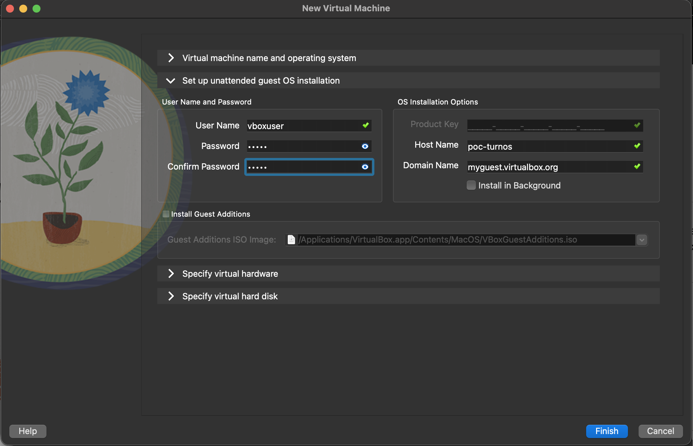

### Paso 7. Asignar memoria y CPU

En `Specify virtual hardware` define los recursos minimos de la VM.

Para este proyecto alcanza con:

- `1024 MB` de RAM
- `1 CPU`

Si tu computadora anfitriona tiene recursos suficientes, puedes aumentar esos valores para trabajar mas comodo.

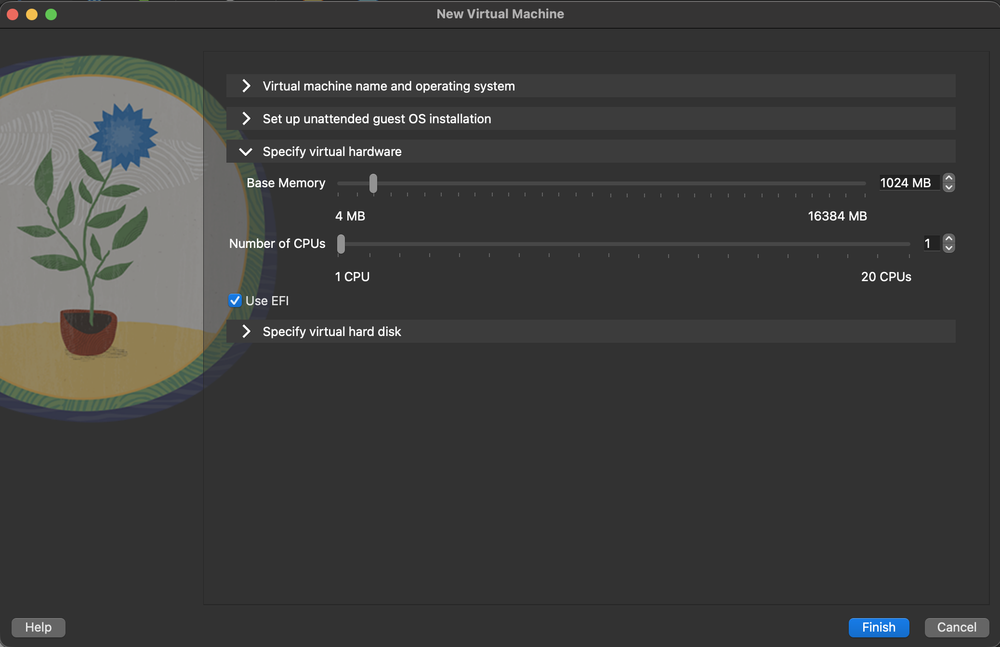

### Paso 8. Crear el disco virtual

En `Specify virtual hard disk` crea un disco nuevo para la VM.

Configuracion sugerida:

- crear un disco nuevo
- formato `VDI`
- tamano aproximado de `8 GB` o mas

Con eso Ubuntu Server y el proyecto pueden instalarse sin problemas para esta practica.

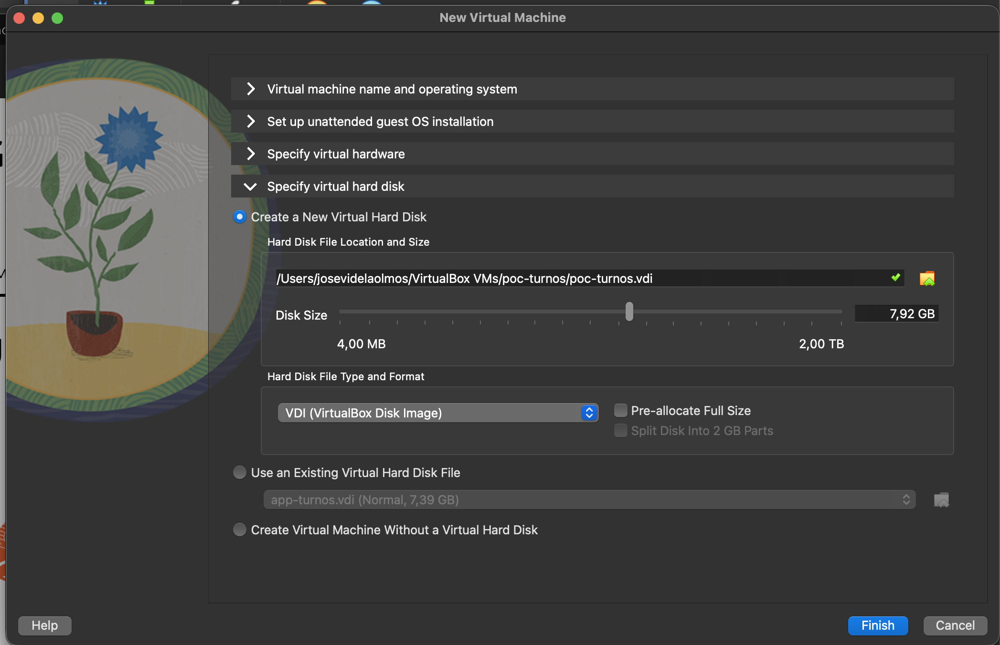

### Paso 9. Finalizar la creacion e instalar Ubuntu Server

Presiona `Finish`, inicia la maquina virtual y espera a que Ubuntu Server complete la instalacion. Cuando termine:

- inicia sesion con el usuario que configuraste
- verifica que tienes acceso a la terminal
- deja la VM apagada un momento antes de cambiar la red, si VirtualBox te lo requiere

## Parte 3: Cambiar la red de NAT a Bridge

### Paso 10. Abrir la configuracion de red de la VM

Selecciona la maquina virtual en VirtualBox y entra en `Settings > Network`.

Esta guia usa `Bridged Adapter` para que la VM obtenga una IP visible en la misma red local que tu computadora host. Eso hace posible abrir la app desde el navegador del host usando la IP de Ubuntu.

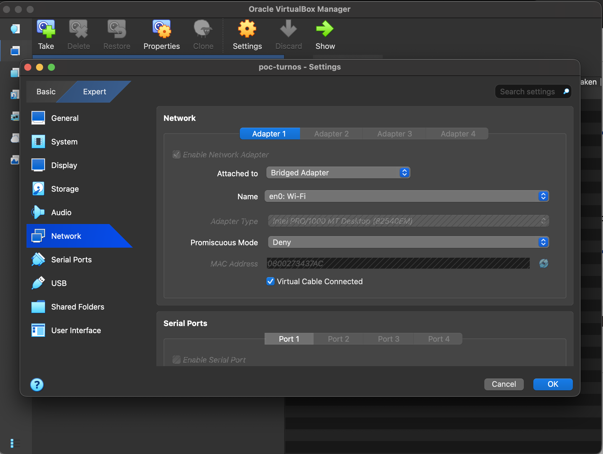

### Paso 11. Pasar el adaptador de NAT a Bridged Adapter

En `Adapter 1`:

- habilita el adaptador de red si no lo esta
- en `Attached to` elige `Bridged Adapter`
- en `Name` elige la interfaz fisica de tu host

Ejemplo:

- en macOS con Wi-Fi puede aparecer como `en0: Wi-Fi`

Deja marcado `Virtual Cable Connected` y confirma con `OK`.

Importante:

- con `NAT`, la VM sale a internet pero no siempre queda facilmente accesible desde fuera
- con `Bridged Adapter`, la VM recibe una IP de tu red local y puedes entrar al servidor desde tu navegador usando esa IP

## Parte 4: Clonar el repo y preparar el entorno

### Paso 12. Clonar el repositorio dentro de Ubuntu

Con la VM ya iniciada, abre la terminal y ejecuta:

```bash
git clone https://github.com/formatec-c4/clase-1.git
cd clase-1
make init
```

`make init` crea el entorno virtual y prepara lo necesario para correr la app.

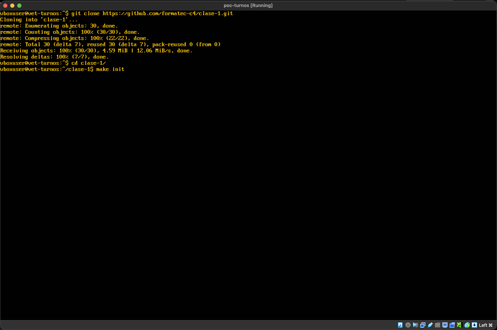

## Parte 5: Ejecutar la app y verla desde el host

### Paso 13. Obtener la IP de la VM e iniciar el servidor

Dentro de la VM, primero consulta la IP con:

```bash
hostname -I
```

Luego inicia la app:

```bash
make run
```

La aplicacion escucha por defecto en `0.0.0.0:8000`, por lo que queda expuesta en todas las interfaces de la VM.

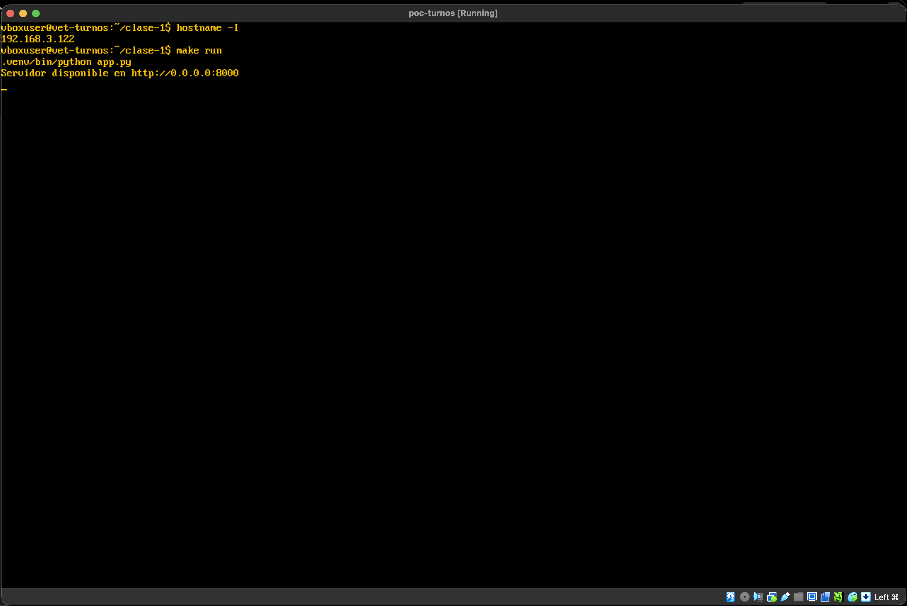

### Paso 14. Abrir la app desde tu navegador

Con la IP que devolvio `hostname -I`, abre en tu computadora host:

```text
http://IP_DE_LA_VM:8000
```

Ejemplo:

```text
http://192.168.3.122:8000
```

Si el modo bridge quedo bien configurado y el servidor esta corriendo, deberias ver la app desde el navegador del host.

## Ejecucion local resumida

Si ya tienes la VM funcionando y solo quieres levantar el proyecto:

```bash
make init
make run
```

Si necesitas cambiar host o puerto:

```bash
HOST=0.0.0.0 PORT=8080 make run
```

## Comprobacion rapida

Antes de cerrar la practica, valida esto:

- la VM arranca correctamente
- Ubuntu Server quedo instalado
- el adaptador de red esta en `Bridged Adapter`
- `hostname -I` devuelve una IP de tu red local
- `make init` termina sin errores
- `make run` muestra el servidor en el puerto `8000`
- puedes entrar desde el host a `http://IP_DE_LA_VM:8000`

## Alcance del proyecto

- agenda publica de turnos
- solicitud de turno sin autenticacion
- reservas en memoria
- UI responsive con colores amigables
